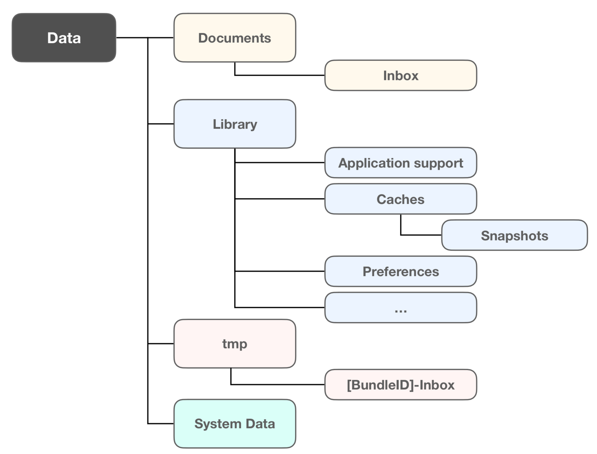

# Swift 문법
> 2018.03.13 업데이트    

## Sandbox
* 반복적으로 실행되는 코드를 만드는 구문   
* 대표적인 반복문으로 while문과 for문이 있다.   

### Sandboxing
* iOS는 사용자의 개인정보를 지키고 안정적인 구동환경을 만들기 위해 앱의 기능을 제약하고 있다. `샌드박스`제약은 `백그라운드 프로세스 제약`과 함께 iOS 앱 기획 시에 반드시 고려해야 하는 제약사항이다.   

### Bundle
`print(Bundle.main.bundlePath)` 로 번들 패스를 받아 패키지 내부를 확인할 수 있다.   

* 파일 시스템 내 하나의 디렉토리    
* 실행 가능(Excutable)파일, Info.plist, 각종 Resources(이미지, 사운드, String 등) 등을 함께 그룹화    
* Codesign Tool 이 Signing을 위해 BundleContainer를 불러와 Code Seal 적용.  
* Static Library - Executable 파일에 통합 컴파일   
* Dynamic Library 및 Framework 는 Frameworks 디렉토리에 존제
* 읽기 전용, 수정이 필요한 경우 데이터 컨테이너에 옮겨서 작업   
* iTunes, iCloud 에 백업되지 않음

__CodeSignature__ - 번들내 파일들을 CodeResources에 해시값으로 기록 관리하여 외부에서의 침입을 막아주는 역할을 한다.

정적 프레임워크 - 실행파일에 포함돼 있어서 앱 실행 시 실행된다.   
동적 프레임워크 - Frameworks 내에 있어, 실행 필요 시 개별적으로 실행된다.

### AppData

`NSHomeDirectory()`
* Data Container 홈 디렉토리  
* 기본 디렉토리 - Documents, Library, tmp   
* 사용자가 직접 디렉토리나 파일을 추가할 수 없으며, Documents 같은 서브 디렉토리를 통해 관리
* StoreKit 등 앱에서 사용하는 데이터에 따라 시스템이 그에 맞는 디렉토리 추가
* iOS 11 부터 SystemData 디렉토리 추가(읽기, 쓰기, 삭제 권한 모두 없음) - 현재 용도 불명확

#### Documents
* 유저가 앱을 통해 생성한 문서나 데이터, 또는 외부 앱을 통해서, 전송한 음악, pdf 등의 컨텐츠를 저장   
* 설정에 따라 유저가 직접 파일 추가 및 삭제 가능, 따라서 유저에 의해 삭제되거나 변경되어도 무방하고 유저가 다루는 컨텐츠와 관련이 있는 파일들만 저장      
* Documents 디렉토리 자체는 삭제 불가, 삭제 시도 시 Documents내의 디렉토리, 파일들만 일괄 삭제   
* iTunes, iCloud 에 백업   

> 유저가 앱을 통해서 생성한 데이터 혹은 외부에서 생성한 컨텐츠를 도큐먼츠 내에 저장이 가능하며, 유저가 직접 삭제가 가능하기 때문에, 실행에 직접적인 문제가 없는 파일들만 보관할 수 있게 한다.

#### Documents/Inbox
`$DocumentsPath + "Inbox"`
* 타앱을 통해 전송받은 파일이 전송되는 저장되는 디렉토리 e.g.)메일 앱 첨부파일 공유 등
* 파일들을 읽거나 삭제할 수 있지만, 새 파일을 추가하거나, 기존 파일은 수정 불가
* 타 앱에서 동일 이름 파일 전달 시 덮어쓰기 대신, `file-1.txt` `file-2.txt]` 처럼 번호 자동 부여하여 새파일 생성
* iOS 9.0부터 디렉토리가 한번 만들어진 이후에 삭제가 불가하며, 파일만 삭제가 가능하고 유저가 직접 생성이 불가하다.
* Documents와 동일하게 디렉토리 삭제 시도 시, Inbox 내의 파일들만 일괄 삭제

#### Library
* 유저 데이터 파일 및 임시 파일을 제외한 모든 파일들을 관리
* 유저에게 노출되는 것을 피하고 앱의 기능이나 관리에 필요한 파일 저장
* 주로 서브 디렉토리인 Application Support 와 Caches 를 이용하지만 커스텀 디렉토리 사용 가능
* Preference, Cookies, Saved Application State, WebKit등 필요할 때 자동 생성
* iTunes, iCloud 에 백업 

####

