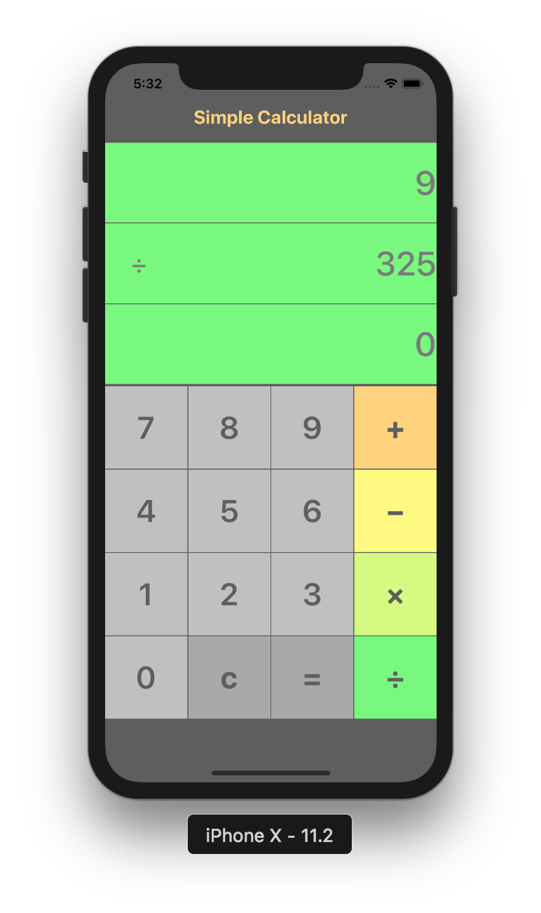

## 실습 내용
   

> 4칙 연산만 적용된 계산기 UI

### ViewController.swift
```swift
import UIKit

/// 계산기뷰의 viewController
class ViewController: UIViewController {
    
    // Label 변수 - storyboard에서 control 버튼을 누르면서 드레그로 위치에 옮긴다.
    @IBOutlet weak var firstNumDisplay: UILabel!
    @IBOutlet weak var secondNumDisplay: UILabel!
    @IBOutlet weak var resultDisplay: UILabel!
    @IBOutlet weak var operationText: UILabel!
    
    // 연산자 상태를 알기위한 변수
    var operationTemp: String = ""
    
    var firstNum: String = "0"
    var secondNum: String = "0"
    var resultNum: String = "0"
    
    override func viewDidLoad() {
        super.viewDidLoad()
        // Do any additional setup after loading the view, typically from a nib.
    }
    
    // MARK: - Action Method
    @IBAction func cilckDidNumber(_ sender: UIButton) {
        // 버튼의 제목 라벨의 텍스트를 상수에 담는다.
        let numberStr = sender.titleLabel!.text!
        
        // operationTemp에 연산자가 있을 경우 secondDisplay에 입력되는 조건문
        if operationTemp.count > 0{
            if secondNum == "0"{
                secondNum = numberStr
            }else{
                secondNum = secondNum + numberStr
            }
            secondNumDisplay.text = secondNum
        }else{
            if firstNum == "0"{
                firstNum = numberStr
                // 첫번째 디스플레이 값이 0일때 디스플레이를 초기화할 수 있는 위치
                resetDisplay()
            }else{
                firstNum = firstNum + numberStr
            }
            firstNumDisplay.text = firstNum
        }
    }
    
    // operationTemp에 연산자를 넣는 함수
    @IBAction func clickDidOperation(_ sender: UIButton) {
        let operStr = sender.titleLabel!.text!
        let firstDisplay = firstNum
        if firstDisplay != "0"{
            operationTemp = operStr
            operationText.text = operationTemp
            
            // 버튼 색상을 추출해서 화면 배경을 바꿔주는 로직
            // sender.backgroundColor를 이용하여 버튼의 색상을 추출할 수 있다.
            let color:UIColor = sender.backgroundColor!
            changeLabelBG(color: color)
        }
    }
    
    // 화면을 초기화하는 함수
    @IBAction func clickDidCancel(_ sender: UIButton) {
        print("did Cancel")
        resetData()
        resetDisplay()
    }
    
    // 결과값을 계산하는 함수
    @IBAction func clickDidResult(_ sender: UIButton) {
        if secondNum != "0"{
            let firstNumTemp: Int = Int(firstNum)!
            let secondNumTemp: Int = Int(secondNum)!
            let op: String = operationTemp
            
            let resultNum = calculation(firstNum: firstNumTemp, operation: op, secondNum: secondNumTemp)
            
            resultDisplay.text = String(resultNum)
            resetData()
        }
    }
    
    //MARK: - Private Method
    
    /// 연산 함수
    /// 두수를 연산자에 따라 연산하고 결과값을 리턴해준다.
    ///
    /// - Parameters:
    ///   - firstNum: 첫번째 디스플레이에 표시된 숫자
    ///   - operation: 연산을 위한 연산자
    ///   - secondNum: 두번째 디스플레이에 표시된 숫자
    /// - Returns: 연산의 결과값
    private func calculation(firstNum: Int, operation: String, secondNum: Int) -> Int{
        var resultNum: Int = 0
        
        switch operation {
        case "+":
            print("더하기 연산")
            resultNum = firstNum + secondNum
        case "−":
            print("빼기 연산")
            resultNum = firstNum - secondNum
        case "×":
            print("곱하기 연산")
            resultNum = firstNum * secondNum
        case "÷":
            print("나누기 연산")
            resultNum = firstNum / secondNum
        default:
            print("이것이 나오면 에러")
        }
        
        return resultNum
    }
    
    //데이터 영역을 초기화하는 함수
    private func resetData(){
        firstNum = "0"
        secondNum = "0"
        resultNum = "0"
        operationTemp = ""
    }
    
    //디스플레이 영역을 초기화하는 함수
    private func resetDisplay(){
        firstNumDisplay.text = "0"
        secondNumDisplay.text = "0"
        resultDisplay.text = "0"
        operationText.text = ""
        
        changeLabelBG(color: .white)
    }
//    // 연산자 기호에 따라 컬러를 바꿔주는 함수
//    private func changeColor(by operation: String){
//        var color: UIColor
//
//        switch operation {
//        case "+":
//            color = .orange
//        case "−":
//            color = .yellow
//        case "×":
//            color = .green
//        case "÷":
//            color = .blue
//        default:
//            color = .white
//            print("이것이 나오면 에러")
//        }
//        changeLabelBG(color: color)
//    }
    
    // 정해진 컬러에 따라 배경화면색에 적용하는 함수
    private func changeLabelBG(color: UIColor){
        firstNumDisplay.backgroundColor = color
        secondNumDisplay.backgroundColor = color
        resultDisplay.backgroundColor = color
    }
    
}

```

## 실습 특이사항
* `//MARK: - comment` 점프바에 나타나는 함수명에 코맨트를 달 수 있다.

* `sender.option` 이벤트를 읽을 수 있는 명령어
```swift
        // 버튼의 제목 라벨의 텍스트를 상수에 담는다.
        let numberStr = sender.titleLabel!.text!
```

* 'storyboard'에 있는 뷰의 액션을 'viewController'에 연결해줄 때는 드레그 하기전 `control`을 눌러서 옮겨줄 수 있다.

## 마무리

`버튼의 신호를 받아 클래스 내 함수 실행`  
스토리보드와 연결된 함수는 해당 뷰의 액션을 받아 함수를 실행하는데, 액션에는 다양한 정보가 담겨 있어 이것을 활용하여, 다양한 연산이 가능하다.

`버튼에서 오는 데이터를 문자화 하여 변수에 저장`  
버튼에서 오는 숫자 데이터를 바로 계산할 수 있도록 Int에 저장할 수 있지만, 그렇게 될 경우 2자리 이상의 수부터는 10진법으로 앞에 있던 숫자 뒤로 입력되는 숫자가 붙는게 아니라 덧샘이 되기 때문에, 스트링으로 문자를 합쳐서 결과 함수 실행때 Int로 변환하여 작업한다.  

`if 조건문`  
계산기의 상황에 맞게 if문을 사용하여 변수의 위치를 바꿔가면서 저장할 수 있다.
