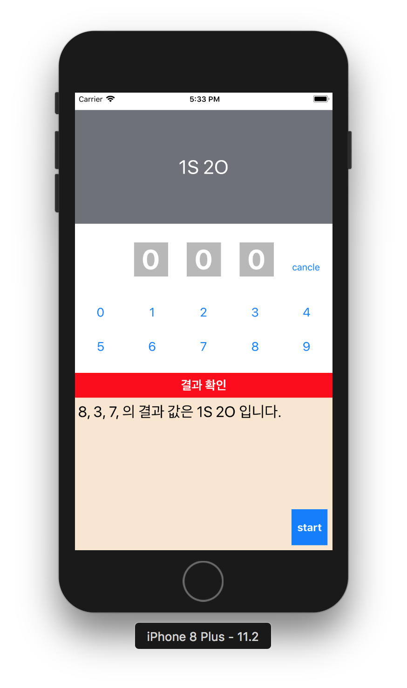

# Swift 숫자 야구 게임 만들기
> 2018.01.25 업데이트

## 실습 내용
   

> 3개의 임의의 숫자를 맞추는 게임   

### ViewController.swift
```swift
//
//  ViewController.swift
//  BaseballGame
//
//  Created by youngmin joo on 2017. 9. 21..
//  Copyright © 2017년 WingsCompany. All rights reserved.
//

import UIKit

class ViewController: UIViewController {

    //MARK : Property
    private var isRunning:Bool = false
    private var selectedNumberList:[Int] = []
    private var secretNumberList:[Int] = []
    
    
    //MARK : - Private Method
    private func makeRandomNumber() -> [Int]{
        //랜덤으로 숫자를 얻어내서 시크릿 번호 3개 알아내기
        var randomNumberList:[Int] = [Int(arc4random_uniform(10))]
        
        //랜덤 숫자 얻는 코드! 10 = 0~9까지는 랜덤숫자한개
        // .contains로 숫자를 확인하여 숫자가 중복되지 않을 경우 숫자를 배열에 넣는다.
        while randomNumberList.count < 3{
            let randomNum:Int = Int(arc4random_uniform(10))
            if !randomNumberList.contains(randomNum){
                randomNumberList.append(randomNum)
            }
        }
        print(randomNumberList)
        return randomNumberList
    }

    /* 결과 확인
     #룰 : S는 결과에 포함되고 자릿수 가 같은,
     B은 결과에 포함은 됐지만 자릿수가 같지 않음.
     O은 결과에 포함도 되지 않음
     #로직 :  레이블의 숫자를 하나씩 가져와서 결과에 포함되어 있는지 확인, 그리고 자리수가 같은지 다시한번 확인
     */
    private func checkAnswer(answer:[Int], correctAnswer:[Int]) -> String
    {
        var strikeCount:Int = 0
        var ballCount:Int = 0
        var outCount:Int = 0
        
        //카운트 구하기
        //사용자가 말한 answer와 정답인 리스트 두개의 리스트를 비교해서
        //스트라이크, 볼, 아웃 카운트 정하기
        for (aIndex, aNum) in answer.enumerated(){
            var flag: Bool = true
            // 두개의 배열의 index와 value를 조회후 숫자와 자리가 맞으면 스트라이크를 반환한다.
            for (cIndex, cNum ) in correctAnswer.enumerated(){
                if aIndex == cIndex && aNum == cNum{
                    strikeCount += 1
                    flag = false
                // 숫자만 맞을 경우 볼을 반환한다.
                }else if aNum == cNum{
                    ballCount += 1
                    flag = false
                }
            }
            // 모든 배열이 끝난 후 아무것도 반환한게 없으면 아웃을 반환한다.
            if flag {outCount += 1}
        }
        
        //make result Str
        var resultStr:String = ""
        if strikeCount > 0{
            resultStr += "\(strikeCount)S "
        }
        
        if ballCount > 0{
            resultStr += "\(ballCount)B "
        }
        
        if outCount > 0{
            resultStr += "\(outCount)O "
        }
        
        return resultStr
    }
    
    
    private func clear(){
        //선택된 숫자 리스트 리셋
        selectedNumberList = []
        
        //화면 리셋
        guard let  selectNumLBList = selectNumLBList else {return}

        for lb in selectNumLBList{
            lb.text = "0"
        }
    }
    

    private var historyText:String = ""
    
    private func addHistory(answer:[Int], score:String){
        //answer -> Int로 변경하기
        //밑에 문제를 해결후 주석 풀어 주세요
        let answerStr = changeStrFrom(list:answer)
        let text = answerStr + "의 결과 값은 \(score)입니다."
        
        //저장
        historyText += text + "\n"
        historyTextView.text = historyText
    }
    
    //배열의 내용을 스트링으로 변환 해주는 함수
    //ex : input [1,2,3] output "123"
    func changeStrFrom(list:[Int]) -> String{
        var resultStr: String = ""
        for str in list{
            resultStr += String(str) + ", "
        }
        return resultStr
    }
    
    //////////////////////////////////////////////
    //////////////////////////////////////////////
    //////////////////////////////////////////////
    //////////////////////////////////////////////
    
    //MARK: - UI
    
    //MARK : UIOutlet
    @IBOutlet weak var displayLB: UILabel!
    @IBOutlet weak var selecNum1LB: UILabel!
    @IBOutlet weak var selecNum2LB: UILabel!
    @IBOutlet weak var selecNum3LB: UILabel!
    @IBOutlet weak var historyTextView: UITextView!
    private var selectNumLBList:[UILabel]?
    
    //MARK : UIAction
    /*
     1. 시작 버튼
     - 랜덤으로 3자리 숫자 생성 : 중복 숫자 제거 로직
     
     - 게임 종료까지 리셋 버튼으로 텍스트 변경
     */
    //시작 버튼
    @IBAction func handleStartBtn(_ sender: UIButton) {
        //- 게임 시작상태 변경
        isRunning = true
        //문재 생성
        secretNumberList = makeRandomNumber()
        //시크릿 넘버 보이기
        historyText = ""
        displayLB.text = ""
        //초기화
        clear()
    }
    
    /*
     2. 숫자 버튼 클릭
     - 결과 레이블에 추가
     - 레이블이 각각 다른 인스턴스 인데 어떻게 추가해야되나?
     - 중복 숫자 입력 방지
     */
    //숫자 입력
    @IBAction func handleInputNumBtn(_ sender: UIButton) {
        
        guard let checkLBList = selectNumLBList else {return}
        
        let selectedNum = sender.tag
        
        if isRunning && selectedNumberList.count < checkLBList.count && !selectedNumberList.contains(selectedNum)//
        {
            selectedNumberList.append(selectedNum)
            let lastIndex = selectedNumberList.count - 1
            
            let inputLB = checkLBList[lastIndex]
            inputLB.text = "\(selectedNum)"
        }
    }
    
    
    //input된 숫자 지우기
    @IBAction func handleRemoveBtn(_ sender: UIButton) {
        if isRunning
        {
            clear()
        }
    }
    
    
    /*
     3. 체크버튼 클릭
     - 결과 확인 로직
     - 맞춤 : 성공 메세지 출력 : 몇번 만에 맞췄는지 알려준다.
     # : 게임이 대기 상태로 전환 된다.
     - 못맞춤 : 현재 게임 스코어 출력
     
     
     - 결과를 textView에 표시
     
     - 게임 대기중 입력 방지
     */
    //결과 확인 버튼
    @IBAction func handleCheckBtn(_ sender: UIButton) {
        if isRunning && selectedNumberList.count == secretNumberList.count
        {
            let score = checkAnswer(answer:selectedNumberList, correctAnswer: secretNumberList)
            if score == "3S "
            {
                displayLB.text = "정답입니다."
            }else
            {
                displayLB.text = "\(score)"
                addHistory(answer: selectedNumberList, score: score)
            }
            clear()
        }
    }
    
    //MARK : - Life Cycle
    override func viewDidLoad() {
        super.viewDidLoad()
        selectNumLBList = [selecNum1LB,selecNum2LB,selecNum3LB]
    }
    
    
}
```
