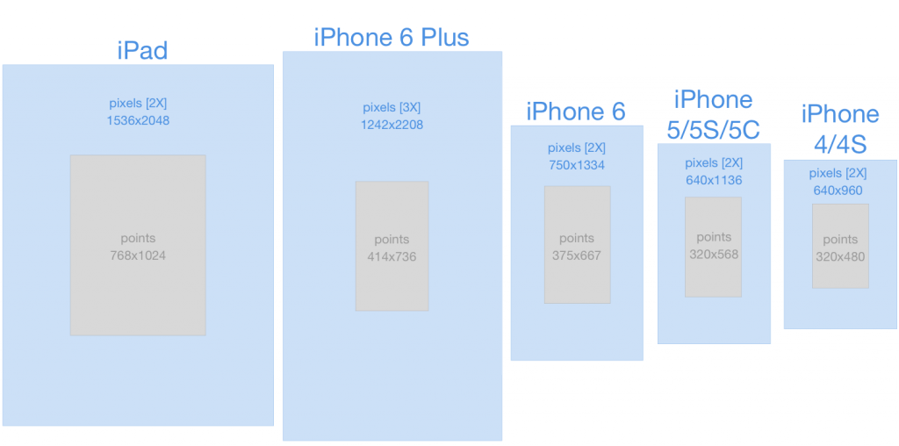
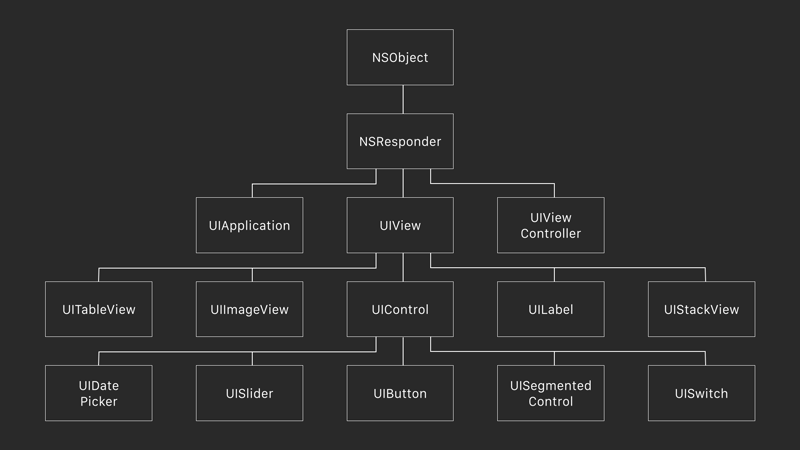

# Swift 문법
> 2018.02.01 업데이트    

## UI Base
* Pixel : 실제 이미지 사이즈   
* Point : 화면에 표시되는 이미지 사이즈    


출처 : http://jasonprini.com/the-new-ios-canvas/
> 화면 기술의 발전으로 pixel단위로 개발할 경우 디스플레이마다 보여지는 크기가 다르기 때문에, 포인트 개념을 사용하여 UI크기의 통일성을 줄 수 있다.

### 좌표계(Frame-Base)
* 좌표계 : View기준 좌측 상단이 0, 0이다.   
* View의 위치는 상대적으로 상위뷰(super view)를 기준으로 위치를 잡는다.  
> 상위뷰의 크기를 구할 때는 `super.view.frame.size.width` (가로 크기)로 구한다. 세로 크기는 width 대신 height를 사용한다.

### 프레임워크(Framework) 란
* 애플리케이션 프레임워크(Application Framework)는 프로그래밍에서 특정 운영 체제를 위한 응용 프로그램 표준 구조를 구현하는 클래스와 라이브러리 모임이다. 간단하게 프레임워크라고도 부른다.  
* 재사용할 수 있는 수많은 코드를 프레임워크로 통합함으로써 개발자가 새로운 애플리케이션을 위한 표준 코드를 다시 작성하지 않아도 같이 사용된다.   
* 프레임워크의 구현은 객체 지향 프로그래밍 기법이 사용되고 있는 응용 프로그램 고유의 클래스가 프레임워크의 기존 클래스를 상속할 수 있다.

#### UIKit Framework
* Cocoa Touch Framework에 추가된 UI관련 기능의 클래스가 모여있는 Framework
* `import UIKit` 로 선언


출처 : http://machinethink.net/blog/mixins-and-traits-in-swift-2.0/

### UIResponder
* 이벤트에 응답하고 처리하기위한 추상 인터페이스

> UIView 는 UIResponder 의 하위 클래스로서 각각 다른 터치 이벤트를 처리할 네 개의 메소드를 재정의할 수 있다.   

```swift
open func touchesBegan(_ touches: Set<UITouch>, with event: UIEvent?) 
open func touchesMoved(_ touches: Set<UITouch>, with event: UIEvent?)
open func touchesEnded(_ touches: Set<UITouch>, with event: UIEvent?) 
open func touchesCancelled(_ touches: Set<UITouch>, with event: UIEvent?)
```

### UIView
* 가장 기본이 되는 View   
* UIComponent들의 조합으로 화면이 구성되며 UIView를 상속 받았다. 즉 iOS 화면구성은 UIView의 집합으로 되어 있다.

#### UIView Class
```swift
public init(frame: CGRect)
open var tag: Int 
open var layer: CALayer { get } 
open var frame: CGRect
open var bounds: CGRect
open var isMultipleTouchEnabled: Bool
open var clipsToBounds: Bool
open var backgroundColor: UIColor?
open var isHidden: Bool
open var contentMode: UIViewContentMode

open func addSubviwe(_ view: UIView) 
open func insertSubview(_ view: UIView, at index: Int)
open func removeFromSuperview()
open func layoutIfNeeded()
```

#### UIView 예제
```swift
// 객체 생성
let newView = UIView(frame: CGRect(x: 0, y: 0, width: 100, height: 100))
// 배경색 변경
newView.backgroundColor = UIColor.green
// 뷰 투명도 50%
newView.alpha = 0.5
// 뷰 추가
self.view.addSubview(newView)
```

#### UILabel 예제
```swift
// 객체 생성
let newLb = UILabel(frame: CGRect(x: 0, y: 0, width: 100, height: 30))
// 레이블 텍스트 변경
newLb.text = "테스트"
// 텍스트 컬러 변경
newLb.textColor = UIColor.gray
// 텍스트 중앙 정렬
newLb.textAlignment = NSTextAlignment.center
// 폰트 사이즈 변경
newLb.font = UIFont.systemFont(ofSize: 10)
newView.addSubview(newLb)
```

#### UIFont

> UIFont as explained in Apple Developer documentation

#### UIImageView 예제
```swift
let newImgV = UIImageView(frame: CGRect(x: 5, y: 5, width: 90, height: 90))
newImgV.image = UIImage(named:"img.png") 
newImgV.contentMode = UIViewContentMode.scaleAspectFit
newView.addSubview(newImgV)
```

#### UIControl
* UIComponent에 사용자 인터렉션에 의한 응답에 대해 특별한 액션을 줄수 있게 설정하는 클래스   
```swift
public static var normal: UIControlState { get } 
public static var highlighted: UIControlState { get }
public static var disabled: UIControlState { get }
public static var selected: UIControlState { get }

open var isEnabled: Bool
open var isSelected: Bool
open func addTarget(_ target: Any?, action: Selector, for controlEvents: UIControlEvents)
```

#### UIButton
* 사용자의 이벤트를 받아 처리해주는 UI 
* 버튼 구조 : Title, Image, backgroundImage

```swift
let btn = UIButton(frame: CGRect(x: 0, y: 0, width: 100, height: 100)) btn.titleLabel?.text = "버튼"btn.setBackgroundImage(UIImage(named:"bg1.png"), for: UIControlState.normal) btn.setTitleColor(.green, for: .normal) btn.addTarget(self,          action:#selector(ViewController.btnAction(sender:)),             for: .touchUpInside)self.view.addSubview(btn)
```
